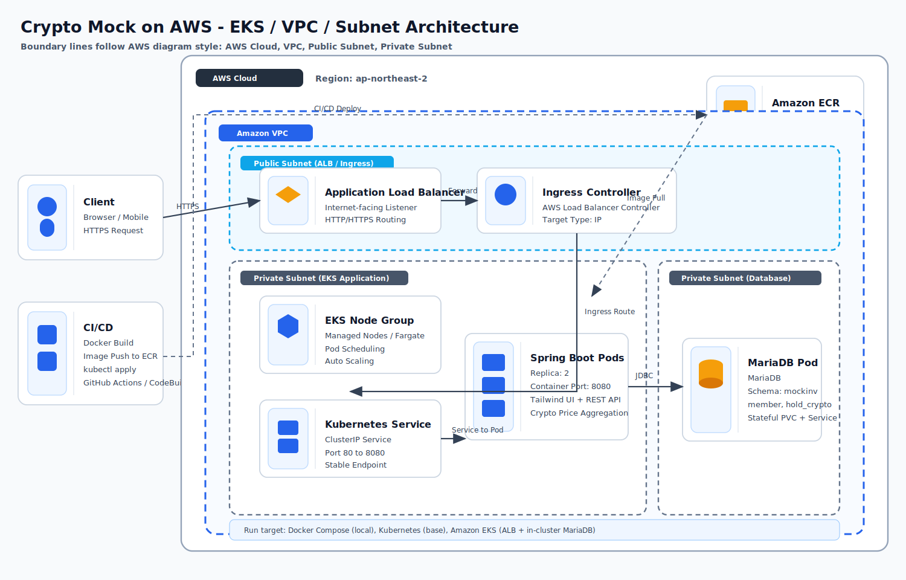
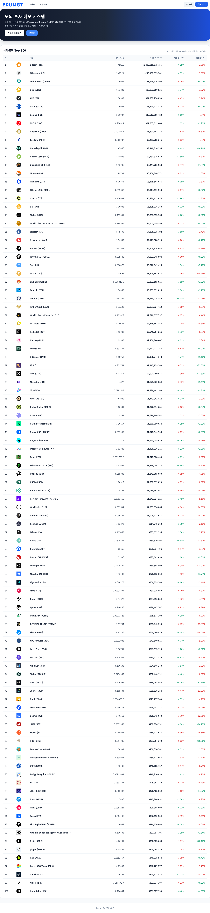
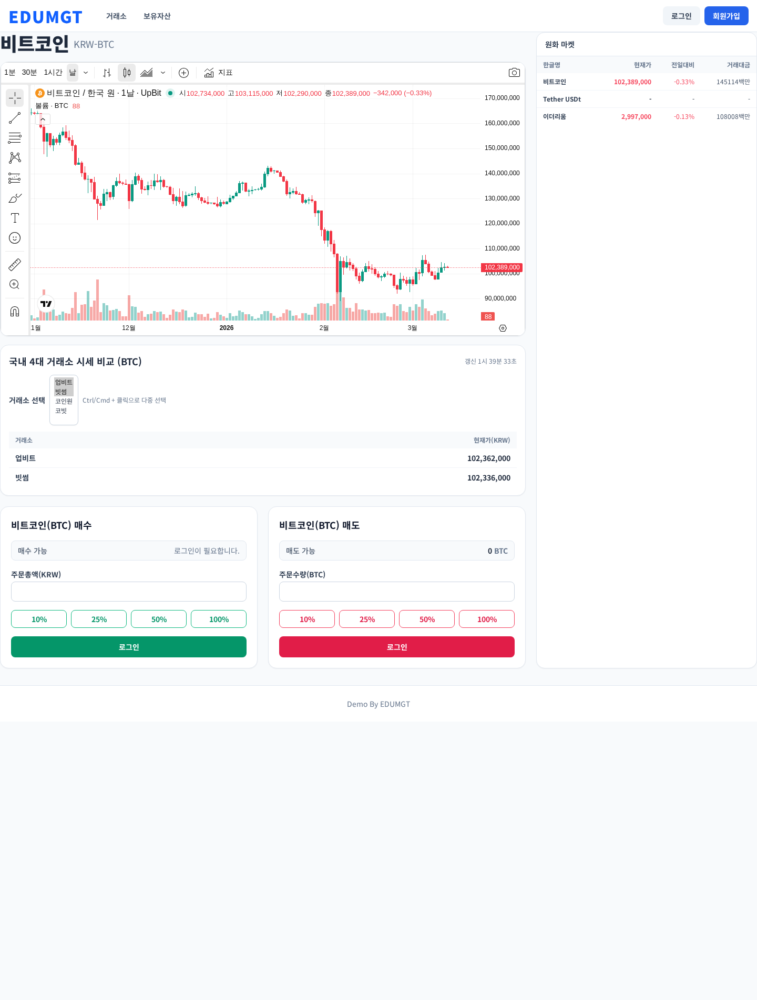

# Crypto Mock Private

Spring Boot + Thymeleaf 기반의 가상 암호화폐 모의투자 웹 애플리케이션입니다.  
거래 화면에서 국내 4대 거래소(업비트/빗썸/코인원/코빗) 시세를 동시에 확인할 수 있고, UI는 **Tailwind CSS 기반**으로 구성되어 있습니다.

---

## 1) 주요 기능

- Tailwind 기반 반응형 UI
- 회원가입/로그인(세션 + BCrypt)
- KRW 마켓 기준 모의 매수/매도
- 보유자산(평가금액/수익률) 실시간 계산
- 업비트 WebSocket 실시간 시세
- 국내 4대 거래소 시세 비교 API (`/api/crypto/{code}/domestic-prices`)
- Docker / Kubernetes / Amazon EKS 배포 구성 (DB 포함)

---

## 2) 테스트 로그인 계정

앱 시작 시 아래 계정이 없으면 자동 생성됩니다.

- `test1@test.com / 123456`
- `test2@test.com / 123456`

---

## 3) 기술 스택

- Backend: Java 17, Spring Boot 3.1.2, Spring MVC, Spring Data JPA
- Frontend: Thymeleaf, Tailwind CSS, JavaScript
- Security: BCrypt + Session
- DB: MariaDB
- Infra: Docker, Docker Compose, Kubernetes, Amazon EKS
- External API:
  - Upbit REST/WebSocket
  - Bithumb REST
  - Coinone REST
  - Korbit REST
  - CoinMarketCap REST

---

## 4) Docker 실행

### 4-1. 실행

```bash
docker compose up -d --build
```

### 4-2. 접속

- `http://localhost:8080`

### 4-3. 종료

```bash
docker compose down
```

데이터까지 삭제:

```bash
docker compose down -v
```

---

## 5) Kubernetes 실행 (일반 k8s)

`k8s/base`는 앱 + MariaDB(in-cluster) 구성을 포함합니다.

### 5-1. 이미지 준비

```bash
docker build -t java-crypto-mock-app:latest .
```

### 5-2. 배포

```bash
kubectl apply -k k8s/base
```

### 5-3. 접속 (포트포워드)

```bash
kubectl -n crypto-mock port-forward svc/crypto-mock-app 8080:80
```

브라우저: `http://localhost:8080`

---

## 6) Amazon EKS 실행

`k8s/eks`는 **EKS + ALB Ingress + in-cluster MariaDB(컨테이너 DB)** 구성입니다.

### 6-1. 사전 준비

- EKS 클러스터
- AWS Load Balancer Controller 설치
- ECR 리포지토리 생성

### 6-2. 이미지 빌드/푸시 (예시)

```bash
aws ecr get-login-password --region ap-northeast-2 | docker login --username AWS --password-stdin 123456789012.dkr.ecr.ap-northeast-2.amazonaws.com
docker build -t java-crypto-mock:latest .
docker tag java-crypto-mock:latest 123456789012.dkr.ecr.ap-northeast-2.amazonaws.com/java-crypto-mock:latest
docker push 123456789012.dkr.ecr.ap-northeast-2.amazonaws.com/java-crypto-mock:latest
```

### 6-3. 값 수정

- `k8s/eks/app-deployment.yaml`의 ECR 이미지 경로
- (필요 시) `k8s/eks/secret.yaml`의 DB 비밀번호
- (필요 시) `k8s/eks/mariadb-pvc.yaml`의 저장 용량/스토리지 클래스

### 6-4. 배포

```bash
kubectl apply -k k8s/eks
```

ALB 주소 확인:

```bash
kubectl -n crypto-mock get ingress crypto-mock-ingress
```

### 6-5. 순차 실행 SH (aws cli + eksctl + kubectl)

아래는 이 저장소를 EKS에 올리기 위한 순차 실행 예시입니다.

1. `01-env.sh` (환경 변수 및 도구 점검)

```bash
set -euo pipefail

export AWS_REGION="ap-northeast-2"
export CLUSTER_NAME="crypto-mock-eks"
export APP_NAMESPACE="crypto-mock"
export ECR_REPO="java-crypto-mock"
export IMAGE_TAG="$(date +%Y%m%d%H%M%S)"
export AWS_ACCOUNT_ID="$(aws sts get-caller-identity --query Account --output text)"
export ECR_URI="${AWS_ACCOUNT_ID}.dkr.ecr.${AWS_REGION}.amazonaws.com/${ECR_REPO}"

aws --version
eksctl version
kubectl version --client
```

2. `02-create-infra.sh` (ECR + EKS 클러스터 생성)

```bash
set -euo pipefail

aws ecr describe-repositories \
  --repository-names "${ECR_REPO}" \
  --region "${AWS_REGION}" >/dev/null 2>&1 || \
aws ecr create-repository \
  --repository-name "${ECR_REPO}" \
  --image-scanning-configuration scanOnPush=true \
  --region "${AWS_REGION}"

eksctl create cluster \
  --name "${CLUSTER_NAME}" \
  --region "${AWS_REGION}" \
  --version 1.30 \
  --nodegroup-name "main-ng" \
  --node-type "t3.medium" \
  --nodes 2 \
  --nodes-min 2 \
  --nodes-max 4 \
  --managed

aws eks update-kubeconfig \
  --name "${CLUSTER_NAME}" \
  --region "${AWS_REGION}"
```

3. `03-build-push-image.sh` (이미지 빌드/푸시)

```bash
set -euo pipefail

aws ecr get-login-password --region "${AWS_REGION}" | \
docker login --username AWS --password-stdin "${AWS_ACCOUNT_ID}.dkr.ecr.${AWS_REGION}.amazonaws.com"

docker build -t "${ECR_REPO}:${IMAGE_TAG}" .
docker tag "${ECR_REPO}:${IMAGE_TAG}" "${ECR_URI}:${IMAGE_TAG}"
docker tag "${ECR_REPO}:${IMAGE_TAG}" "${ECR_URI}:latest"
docker push "${ECR_URI}:${IMAGE_TAG}"
docker push "${ECR_URI}:latest"
```

4. `04-deploy.sh` (매니페스트 배포 + 앱 이미지 교체)

```bash
set -euo pipefail

kubectl apply -k k8s/eks
kubectl -n "${APP_NAMESPACE}" set image deployment/crypto-mock-app app="${ECR_URI}:${IMAGE_TAG}"
kubectl -n "${APP_NAMESPACE}" rollout status deployment/crypto-mock-app --timeout=300s
```

5. `05-verify.sh` (상태 확인)

```bash
set -euo pipefail

kubectl -n "${APP_NAMESPACE}" get pods
kubectl -n "${APP_NAMESPACE}" get svc
kubectl -n "${APP_NAMESPACE}" get ingress

echo "ALB DNS:"
kubectl -n "${APP_NAMESPACE}" get ingress crypto-mock-ingress \
  -o jsonpath='{.status.loadBalancer.ingress[0].hostname}'; echo
```

6. `06-cleanup.sh` (정리, 필요 시)

```bash
set -euo pipefail

eksctl delete cluster --name "${CLUSTER_NAME}" --region "${AWS_REGION}"
aws ecr batch-delete-image \
  --repository-name "${ECR_REPO}" \
  --image-ids imageTag=latest \
  --region "${AWS_REGION}" || true
```

---

## 7) AWS 아키텍처 (SVG)

선이 복잡하지 않도록 단순화한 AWS 아이콘 스타일의 SVG 다이어그램입니다.  
EKS 내부에서 앱과 MariaDB가 함께 동작하는 구조를 표현합니다.



---

## 8) 화면 캡처

1. Tailwind 홈 화면



2. 거래 화면(BTC) + 멀티 선택(업비트 + 빗썸)



3. 거래 화면(ETH) + 멀티 선택(코인원 + 코빗)


---

## 9) 주요 경로

- Docker: `Dockerfile`, `docker-compose.yml`
- Kubernetes(base): `k8s/base/*`
- EKS: `k8s/eks/*`
- AWS 아키텍처 SVG: `docs/architecture-eks.svg`
- 거래 화면: `src/main/resources/templates/trade/order.html`
